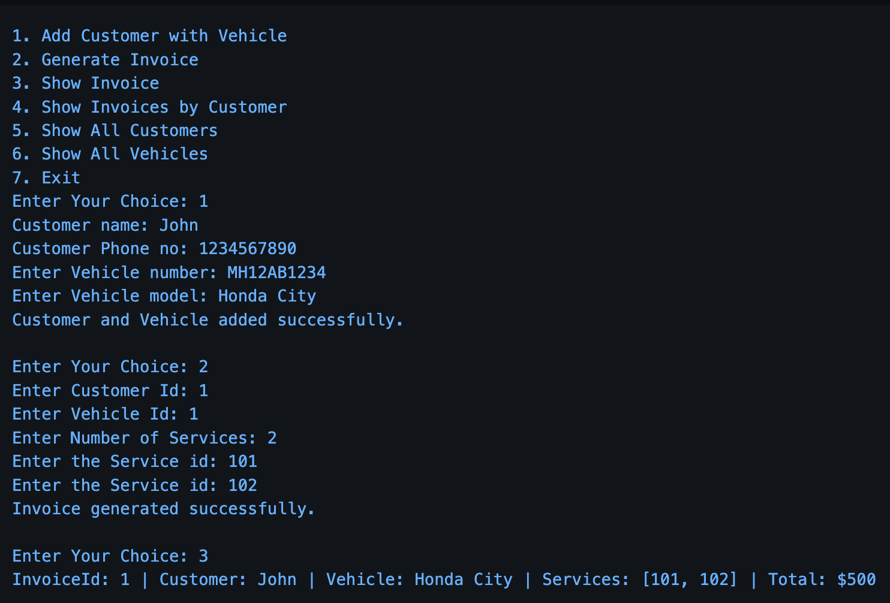

# Garage Service Billing System - Java Console App

A Java console-based application to manage a garage service center. It supports adding customers with vehicles, generating invoices for services, and viewing records. Ideal for learning Java OOP, console-based input handling, and simple backend logic.

---

## ✨ Features

- 👤 Add Customers with their Vehicles  
- 🧾 Generate Invoices for services  
- 📄 View all invoices  
- 🔎 View invoices by specific customer  
- 🚗 List all registered vehicles  
- 👥 List all registered customers  
- 🚪 Exit the application  

---

## 🛠 Tech Stack

- **Language:** Java (JDK 23)  
- **IDE:** IntelliJ IDEA (or any Java IDE)  
- **Concepts:** OOP (Encapsulation, Inheritance, Polymorphism), Collections API  
- **Data Handling:** Lists, Maps  
- **Input Handling:** Scanner-based console input  

---

## ▶️ How to Run

1. Clone the repository:
```bash
git clone https://github.com/theyashshelar/Garage-Service-Billing-System.git
```
2. Open the project in IntelliJ IDEA or any Java IDE.

3. Ensure you have MySQL Connector JAR added to your project classpath.

4. Run App.java from the src folder.

## 📸 Application Preview



🚀 Future Improvements

- Add database persistence (MySQL/PostgreSQL) for storing customers, vehicles, and invoices

- Implement a GUI using JavaFX or Swing

- Add detailed service catalog with pricing and service descriptions

---

- 👨‍💻 Developed by Yash Shelar

- 📧 Email: yashshelar006@gmail.com

- 🔗 GitHub: theyashshelar

